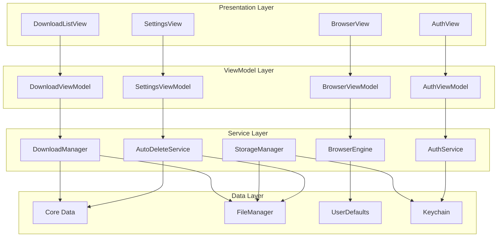
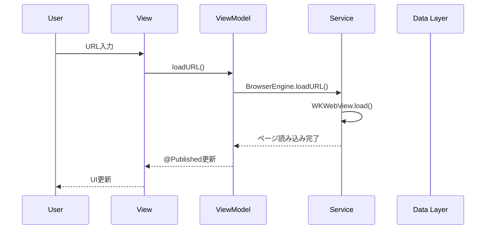
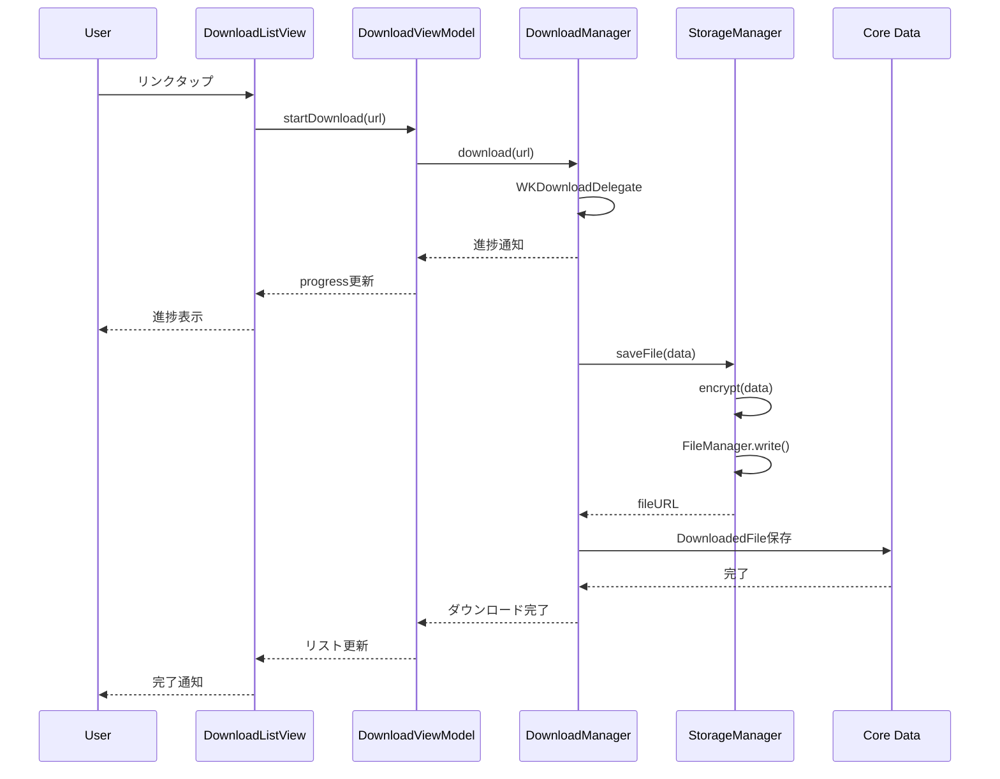

# アーキテクチャ設計

**最終更新**: 2025年10月8日

---

## 🏗️ システム構成図



---

## 🎨 MVVMアーキテクチャ

### アーキテクチャ選定理由

**SwiftUI + MVVMを採用**:
1. **宣言的UI**: SwiftUIとの親和性が高い
2. **テスタビリティ**: ViewModelが独立してテスト可能
3. **保守性**: 責務が明確で変更に強い
4. **学習コスト**: SwiftUIの標準的なパターン

**他のアーキテクチャとの比較**:

| アーキテクチャ | メリット | デメリット | 採用判断 |
|--------------|---------|-----------|---------|
| **MVVM** | SwiftUI親和性、テスト容易 | 初期学習コスト | ✅ 採用 |
| MVC | シンプル | Massive View Controller問題 | ❌ 不採用 |
| VIPER | 高度な分離 | 複雑すぎる（小規模アプリに過剰） | ❌ 不採用 |
| Redux | 状態管理明確 | ボイラープレート多い | ❌ 不採用 |

---

### レイヤー構成

#### 1. View Layer（表示層）

**責務**:
- UIの描画
- ユーザー操作の受け取り
- ViewModelへのイベント通知

**実装例**:
```swift
import SwiftUI

struct BrowserView: View {
    @StateObject private var viewModel = BrowserViewModel()

    var body: some View {
        VStack {
            // URLバー
            HStack {
                TextField("URL", text: $viewModel.urlString)
                    .textFieldStyle(.roundedBorder)
                    .onSubmit {
                        viewModel.loadURL()
                    }

                Button(action: viewModel.reload) {
                    Image(systemName: "arrow.clockwise")
                }
            }
            .padding()

            // WebView
            WebView(webView: viewModel.webView)

            // ツールバー
            HStack {
                Button(action: viewModel.goBack) {
                    Image(systemName: "chevron.left")
                }
                .disabled(!viewModel.canGoBack)

                Spacer()

                Button(action: viewModel.goForward) {
                    Image(systemName: "chevron.right")
                }
                .disabled(!viewModel.canGoForward)
            }
            .padding()
        }
    }
}
```

**ルール**:
- ✅ ビジネスロジックを持たない
- ✅ ViewModelのプロパティをバインディング
- ❌ 直接Modelにアクセスしない

---

#### 2. ViewModel Layer（プレゼンテーション層）

**責務**:
- ビジネスロジック
- 状態管理
- ServiceLayerへの委譲

**実装例**:
```swift
import Foundation
import Combine
import WebKit

@MainActor
class BrowserViewModel: ObservableObject {
    // MARK: - Published Properties
    @Published var urlString: String = ""
    @Published var isLoading: Bool = false
    @Published var canGoBack: Bool = false
    @Published var canGoForward: Bool = false

    // MARK: - Dependencies
    private let browserEngine: BrowserEngine
    let webView: WKWebView

    // MARK: - Initialization
    init(browserEngine: BrowserEngine = .shared) {
        self.browserEngine = browserEngine
        self.webView = browserEngine.webView

        observeWebView()
    }

    // MARK: - Public Methods
    func loadURL() {
        browserEngine.loadURL(urlString)
    }

    func reload() {
        browserEngine.reload()
    }

    func goBack() {
        browserEngine.goBack()
    }

    func goForward() {
        browserEngine.goForward()
    }

    // MARK: - Private Methods
    private func observeWebView() {
        webView.publisher(for: \.canGoBack)
            .assign(to: &$canGoBack)

        webView.publisher(for: \.canGoForward)
            .assign(to: &$canGoForward)

        webView.publisher(for: \.isLoading)
            .assign(to: &$isLoading)
    }
}
```

**ルール**:
- ✅ `@Published`でViewに状態を通知
- ✅ Serviceレイヤーに処理を委譲
- ✅ `@MainActor`でメインスレッド実行保証
- ❌ UIKit/SwiftUIコンポーネントを直接操作しない

---

#### 3. Service Layer（ビジネスロジック層）

**責務**:
- ドメインロジック
- データ永続化
- 外部リソースアクセス

**主要サービス**:

| サービス | 責務 |
|---------|------|
| **BrowserEngine** | WKWebView管理、ページ読み込み |
| **DownloadManager** | ファイルDL、進捗管理 |
| **StorageManager** | ファイル暗号化、保存 |
| **AutoDeleteService** | 自動削除ロジック |
| **AuthService** | 生体認証 |

**実装例（BrowserEngine）**:
```swift
import WebKit

class BrowserEngine: NSObject {
    static let shared = BrowserEngine()

    let webView: WKWebView
    private let configuration: WKWebViewConfiguration

    private override init() {
        // WKWebView設定
        self.configuration = WKWebViewConfiguration()
        configuration.websiteDataStore = .nonPersistent()  // プライバシー重視
        configuration.allowsInlineMediaPlayback = true

        self.webView = WKWebView(frame: .zero, configuration: configuration)

        super.init()

        webView.navigationDelegate = self
    }

    func loadURL(_ urlString: String) {
        guard let url = URL(string: urlString) else { return }
        let request = URLRequest(url: url)
        webView.load(request)
    }

    func reload() {
        webView.reload()
    }

    func goBack() {
        webView.goBack()
    }

    func goForward() {
        webView.goForward()
    }
}

extension BrowserEngine: WKNavigationDelegate {
    func webView(_ webView: WKWebView, didFinish navigation: WKNavigation!) {
        print("Page loaded: \(webView.url?.absoluteString ?? "")")
    }
}
```

---

#### 4. Data Layer（データアクセス層）

**責務**:
- データ永続化
- CRUD操作

**データストア**:

| ストア | 用途 | 技術 |
|-------|------|------|
| **Core Data** | ブックマーク、DL履歴 | NSPersistentContainer |
| **FileManager** | ダウンロードファイル | Documents/Downloads/ |
| **UserDefaults** | アプリ設定、最終起動日 | 標準API |
| **Keychain** | 暗号化鍵 | Security.framework |

**実装例（StorageManager）**:
```swift
import Foundation
import CryptoKit

class StorageManager {
    static let shared = StorageManager()

    private let fileManager = FileManager.default
    private let downloadsDirectory: URL

    private init() {
        let documentsURL = fileManager.urls(
            for: .documentDirectory,
            in: .userDomainMask
        )[0]
        downloadsDirectory = documentsURL.appendingPathComponent("Downloads")

        // ディレクトリ作成
        try? fileManager.createDirectory(
            at: downloadsDirectory,
            withIntermediateDirectories: true
        )
    }

    // MARK: - File Operations
    func saveFile(_ data: Data, filename: String) throws -> URL {
        let fileURL = downloadsDirectory.appendingPathComponent(filename)

        // 暗号化
        let encryptedData = try encrypt(data)

        // 保存
        try encryptedData.write(to: fileURL)

        // iCloudバックアップ除外
        var resourceValues = URLResourceValues()
        resourceValues.isExcludedFromBackup = true
        try fileURL.setResourceValues(resourceValues)

        return fileURL
    }

    func loadFile(at url: URL) throws -> Data {
        let encryptedData = try Data(contentsOf: url)
        return try decrypt(encryptedData)
    }

    func deleteFile(at url: URL) throws {
        try fileManager.removeItem(at: url)
    }

    func deleteAllFiles() throws {
        try fileManager.removeItem(at: downloadsDirectory)
        try fileManager.createDirectory(
            at: downloadsDirectory,
            withIntermediateDirectories: true
        )
    }

    // MARK: - Encryption
    private func encrypt(_ data: Data) throws -> Data {
        let key = try getOrCreateKey()
        let sealedBox = try AES.GCM.seal(data, using: key)

        var result = Data()
        result.append(sealedBox.nonce.withUnsafeBytes { Data($0) })
        result.append(sealedBox.ciphertext)
        result.append(sealedBox.tag)

        return result
    }

    private func decrypt(_ data: Data) throws -> Data {
        let key = try getOrCreateKey()

        let nonceSize = 12
        let tagSize = 16

        let nonce = try AES.GCM.Nonce(data: data.prefix(nonceSize))
        let ciphertext = data.dropFirst(nonceSize).dropLast(tagSize)
        let tag = data.suffix(tagSize)

        let sealedBox = try AES.GCM.SealedBox(
            nonce: nonce,
            ciphertext: ciphertext,
            tag: tag
        )

        return try AES.GCM.open(sealedBox, using: key)
    }

    private func getOrCreateKey() throws -> SymmetricKey {
        // Keychainから取得（実装は省略）
        // 詳細はfunctional.mdを参照
        return SymmetricKey(size: .bits256)
    }
}
```

---

## 📂 ディレクトリ構成

```
VanishBrowser/
├── App/
│   ├── VanishBrowserApp.swift          # アプリエントリポイント
│   └── AppDelegate.swift               # ライフサイクル管理
│
├── Models/
│   ├── DownloadedFile.swift            # Core Dataエンティティ
│   ├── Bookmark.swift
│   ├── AppSettings.swift
│   └── VanishBrowser.xcdatamodeld      # Core Dataモデル
│
├── Views/
│   ├── Browser/
│   │   ├── BrowserView.swift           # ブラウザメイン画面
│   │   ├── WebView.swift               # WKWebViewラッパー
│   │   └── URLBar.swift                # URLバーコンポーネント
│   ├── Downloads/
│   │   ├── DownloadListView.swift      # DLファイル一覧
│   │   ├── DownloadItemView.swift      # DLファイル1行
│   │   └── FilePreviewView.swift       # ファイルプレビュー
│   ├── Settings/
│   │   ├── SettingsView.swift          # 設定画面
│   │   └── AboutView.swift             # アプリ情報
│   └── Auth/
│       └── AuthView.swift              # 生体認証画面
│
├── ViewModels/
│   ├── BrowserViewModel.swift
│   ├── DownloadViewModel.swift
│   ├── SettingsViewModel.swift
│   └── AuthViewModel.swift
│
├── Services/
│   ├── BrowserEngine.swift             # WKWebView管理
│   ├── DownloadManager.swift           # ファイルDL管理
│   ├── StorageManager.swift            # ファイル暗号化・保存
│   ├── AutoDeleteService.swift         # 自動削除ロジック
│   └── AuthService.swift               # 生体認証
│
├── Utilities/
│   ├── Extensions/
│   │   ├── Date+Extensions.swift       # Date拡張
│   │   └── URL+Extensions.swift        # URL拡張
│   ├── Constants.swift                 # 定数定義
│   └── Logger.swift                    # ログユーティリティ
│
├── Resources/
│   ├── Assets.xcassets                 # 画像・色リソース
│   ├── Localizable.strings             # 多言語対応
│   └── Info.plist
│
└── Supporting Files/
    └── VanishBrowser.entitlements      # Capabilities設定
```

---

## 🔄 データフロー

### ユーザーアクション → データ更新の流れ



### ファイルダウンロードフロー



---

## 🧩 主要コンポーネント詳細

### 1. BrowserEngine

**責務**: WKWebViewの管理とブラウジング機能

**主要メソッド**:
```swift
class BrowserEngine {
    func loadURL(_ urlString: String)
    func reload()
    func goBack()
    func goForward()
    func stopLoading()
    func evaluateJavaScript(_ script: String) async throws -> Any
}
```

**状態管理**:
- `canGoBack`: Bool
- `canGoForward`: Bool
- `isLoading`: Bool
- `estimatedProgress`: Double

---

### 2. DownloadManager

**責務**: ファイルダウンロードと進捗管理

**主要メソッド**:
```swift
class DownloadManager: NSObject, WKDownloadDelegate {
    func download(from url: URL)
    func cancelDownload(_ download: WKDownload)
    func pauseDownload(_ download: WKDownload)  // iOS 17+
    func resumeDownload(_ download: WKDownload)  // iOS 17+
}
```

**イベント通知**:
```swift
protocol DownloadManagerDelegate {
    func downloadDidStart(_ download: WKDownload)
    func downloadDidProgress(_ download: WKDownload, progress: Double)
    func downloadDidFinish(_ download: WKDownload, at url: URL)
    func downloadDidFail(_ download: WKDownload, error: Error)
}
```

---

### 3. AutoDeleteService

**責務**: 自動削除ロジックの実行

**主要メソッド**:
```swift
class AutoDeleteService {
    func checkAndDeleteIfNeeded()
    func shouldDelete(lastOpened: Date) -> Bool
    func deleteAllData()
    func scheduleDeletionWarning()
}
```

**実装例**:
```swift
class AutoDeleteService {
    private let deletionThresholdDays = 90
    private let warningDays = 7

    func checkAndDeleteIfNeeded() {
        guard let lastOpened = UserDefaults.standard.object(
            forKey: "lastOpenedAt"
        ) as? Date else {
            // 初回起動
            UserDefaults.standard.set(Date(), forKey: "lastOpenedAt")
            return
        }

        if shouldDelete(lastOpened: lastOpened) {
            deleteAllData()
        } else {
            // 次回起動日を更新
            UserDefaults.standard.set(Date(), forKey: "lastOpenedAt")

            // 削除予定日を計算
            scheduleWarningIfNeeded(lastOpened: lastOpened)
        }
    }

    func shouldDelete(lastOpened: Date) -> Bool {
        let days = Calendar.current.dateComponents(
            [.day],
            from: lastOpened,
            to: Date()
        ).day ?? 0

        return days >= deletionThresholdDays
    }

    private func deleteAllData() {
        // ファイル削除
        try? StorageManager.shared.deleteAllFiles()

        // Core Data削除
        CoreDataManager.shared.deleteAllRecords()

        // UserDefaults削除
        UserDefaults.standard.removePersistentDomain(
            forName: Bundle.main.bundleIdentifier!
        )

        // Cookie削除
        WKWebsiteDataStore.default().removeData(
            ofTypes: WKWebsiteDataStore.allWebsiteDataTypes(),
            modifiedSince: .distantPast
        ) {}

        // アプリ終了
        exit(0)
    }
}
```

---

## 🔧 技術的課題と解決策

### 課題1: バックグラウンド実行制限

**問題**:
iOSはバックグラウンドで任意のコードを実行できない。
90日後の自動削除をバックグラウンドで実行不可。

**解決策**:
アプリ起動時に最終起動日をチェックし、90日経過していれば削除。

```swift
func application(_ application: UIApplication,
                 didFinishLaunchingWithOptions launchOptions: [UIApplication.LaunchOptionsKey: Any]?) -> Bool {
    AutoDeleteService().checkAndDeleteIfNeeded()
    return true
}
```

---

### 課題2: iCloudバックアップ問題

**問題**:
デフォルトでiCloudにバックアップされ、デジタル遺品が残る。

**解決策**:
ファイル作成時に`isExcludedFromBackup`を設定。

```swift
var resourceValues = URLResourceValues()
resourceValues.isExcludedFromBackup = true
try fileURL.setResourceValues(resourceValues)
```

---

### 課題3: WKWebViewメモリリーク

**問題**:
WKWebViewはメモリリークしやすい。

**解決策**:
1. ViewModelでwebViewを保持
2. deinitでクリーンアップ

```swift
deinit {
    webView.stopLoading()
    webView.configuration.userContentController.removeAllUserScripts()
}
```

---

### 課題4: ダウンロード進捗の表示

**問題**:
複数ファイルのDL進捗を管理。

**解決策**:
`DownloadManager`で辞書管理。

```swift
class DownloadManager {
    private var activeDownloads: [UUID: DownloadProgress] = [:]

    struct DownloadProgress {
        var download: WKDownload
        var progress: Double
        var totalBytes: Int64
    }
}
```

---

## 📋 アーキテクチャ決定記録（ADR）

### ADR-001: MVVMアーキテクチャの採用

**日付**: 2025-10-08
**ステータス**: 承認
**決定**: SwiftUI + MVVMを採用

**理由**:
- SwiftUIとの親和性
- テスタビリティ
- 保守性

**代替案**: MVC, VIPER, Redux
**結果**: MVVMを採用

---

### ADR-002: Combineによるリアクティブプログラミング

**日付**: 2025-10-08
**ステータス**: 承認
**決定**: Combineを使用

**理由**:
- Apple標準フレームワーク
- SwiftUIとの統合性
- メモリ管理が自動

**代替案**: RxSwift
**結果**: Combineを採用

---

### ADR-003: Core Dataによるデータ永続化

**日付**: 2025-10-08
**ステータス**: 承認
**決定**: Core Dataを使用

**理由**:
- Apple標準
- 暗号化対応
- CloudKit統合（Phase 3用）

**代替案**: Realm, SQLite
**結果**: Core Dataを採用

---

**次のドキュメント**: [データモデル (./data-model.md)](./data-model.md)
