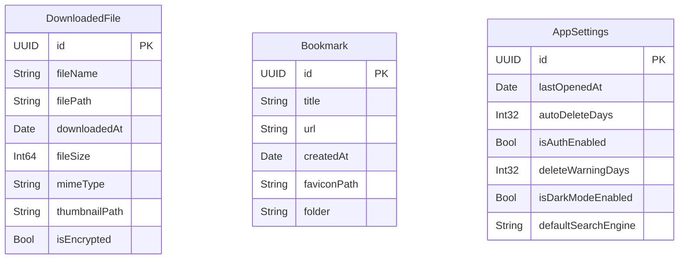
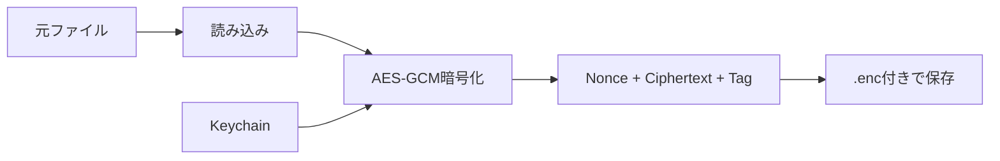

# データモデル

**最終更新**: 2025年10月8日

---

## 📊 Core Data エンティティ定義

### 1. DownloadedFile（ダウンロードファイル）

**用途**: ダウンロードしたファイルのメタデータ管理

| 属性名 | 型 | 必須 | デフォルト値 | 説明 |
|--------|----|----|------------|------|
| `id` | UUID | ✅ | UUID() | 一意識別子 |
| `fileName` | String | ✅ | - | ファイル名（例: video.mp4） |
| `filePath` | String | ✅ | - | 相対パス（Downloads/video.mp4） |
| `downloadedAt` | Date | ✅ | Date() | ダウンロード日時 |
| `fileSize` | Int64 | ✅ | 0 | ファイルサイズ（バイト） |
| `mimeType` | String | ❌ | nil | MIMEタイプ（video/mp4等） |
| `thumbnailPath` | String | ❌ | nil | サムネイル画像パス |
| `isEncrypted` | Bool | ✅ | true | 暗号化済みフラグ |

**Swift定義**:
```swift
import Foundation
import CoreData

@objc(DownloadedFile)
public class DownloadedFile: NSManagedObject, Identifiable {
    @NSManaged public var id: UUID
    @NSManaged public var fileName: String
    @NSManaged public var filePath: String
    @NSManaged public var downloadedAt: Date
    @NSManaged public var fileSize: Int64
    @NSManaged public var mimeType: String?
    @NSManaged public var thumbnailPath: String?
    @NSManaged public var isEncrypted: Bool
}

// MARK: - Convenience Methods
extension DownloadedFile {
    /// ファイルサイズを人間が読める形式で返す
    var formattedFileSize: String {
        ByteCountFormatter.string(
            fromByteCount: fileSize,
            countStyle: .file
        )
    }

    /// ファイルの絶対パスを返す
    var absoluteURL: URL {
        let documentsURL = FileManager.default.urls(
            for: .documentDirectory,
            in: .userDomainMask
        )[0]
        return documentsURL.appendingPathComponent(filePath)
    }

    /// ファイルタイプアイコン（SF Symbols）
    var fileTypeIcon: String {
        guard let mimeType = mimeType else { return "doc" }

        if mimeType.hasPrefix("image/") {
            return "photo"
        } else if mimeType.hasPrefix("video/") {
            return "video"
        } else if mimeType.hasPrefix("audio/") {
            return "music.note"
        } else if mimeType == "application/pdf" {
            return "doc.text"
        } else {
            return "doc"
        }
    }
}
```

---

### 2. Bookmark（ブックマーク）

**用途**: よく見るページのブックマーク保存

| 属性名 | 型 | 必須 | デフォルト値 | 説明 |
|--------|----|----|------------|------|
| `id` | UUID | ✅ | UUID() | 一意識別子 |
| `title` | String | ✅ | - | ページタイトル |
| `url` | String | ✅ | - | URL |
| `createdAt` | Date | ✅ | Date() | 作成日時 |
| `faviconPath` | String | ❌ | nil | ファビコン画像パス |
| `folder` | String | ❌ | "未分類" | フォルダ名 |

**Swift定義**:
```swift
import Foundation
import CoreData

@objc(Bookmark)
public class Bookmark: NSManagedObject, Identifiable {
    @NSManaged public var id: UUID
    @NSManaged public var title: String
    @NSManaged public var url: String
    @NSManaged public var createdAt: Date
    @NSManaged public var faviconPath: String?
    @NSManaged public var folder: String
}

// MARK: - Convenience Methods
extension Bookmark {
    /// URLをURL型で返す
    var urlObject: URL? {
        URL(string: url)
    }

    /// ドメイン名を抽出
    var domain: String? {
        urlObject?.host
    }
}
```

---

### 3. AppSettings（アプリ設定）

**用途**: アプリ全体の設定値

| 属性名 | 型 | 必須 | デフォルト値 | 説明 |
|--------|----|----|------------|------|
| `id` | UUID | ✅ | UUID() | 一意識別子（常に1レコード） |
| `lastOpenedAt` | Date | ✅ | Date() | 最終起動日時 |
| `autoDeleteDays` | Int32 | ✅ | 90 | 自動削除日数 |
| `isAuthEnabled` | Bool | ✅ | true | 生体認証有効フラグ |
| `deleteWarningDays` | Int32 | ✅ | 7 | 削除前通知日数 |
| `isDarkModeEnabled` | Bool | ❌ | nil | ダークモード（nil=システム設定） |
| `defaultSearchEngine` | String | ✅ | "DuckDuckGo" | 検索エンジン |

**Swift定義**:
```swift
import Foundation
import CoreData

@objc(AppSettings)
public class AppSettings: NSManagedObject {
    @NSManaged public var id: UUID
    @NSManaged public var lastOpenedAt: Date
    @NSManaged public var autoDeleteDays: Int32
    @NSManaged public var isAuthEnabled: Bool
    @NSManaged public var deleteWarningDays: Int32
    @NSManaged public var isDarkModeEnabled: NSNumber?
    @NSManaged public var defaultSearchEngine: String
}

// MARK: - Singleton Pattern
extension AppSettings {
    /// 設定を取得（なければ作成）
    static func fetch(context: NSManagedObjectContext) -> AppSettings {
        let request: NSFetchRequest<AppSettings> = AppSettings.fetchRequest()
        request.fetchLimit = 1

        if let settings = try? context.fetch(request).first {
            return settings
        } else {
            // 初回起動時: デフォルト設定を作成
            let settings = AppSettings(context: context)
            settings.id = UUID()
            settings.lastOpenedAt = Date()
            settings.autoDeleteDays = 90
            settings.isAuthEnabled = true
            settings.deleteWarningDays = 7
            settings.defaultSearchEngine = "DuckDuckGo"

            try? context.save()
            return settings
        }
    }

    /// 最終起動日を更新
    func updateLastOpened() {
        lastOpenedAt = Date()
        try? managedObjectContext?.save()
    }
}
```

---

## 🔗 ER図（エンティティ関係図）



**関連性**:
- 各エンティティは独立（リレーションシップなし）
- `AppSettings`は常に1レコードのみ（Singleton）

---

## 💾 データ保存場所

### ファイルシステム構成

```
~/Library/Application Support/VanishBrowser/
├── VanishBrowser.sqlite                # Core Data本体
├── VanishBrowser.sqlite-shm            # 共有メモリファイル
└── VanishBrowser.sqlite-wal            # WAL（Write-Ahead Log）

~/Documents/
└── Downloads/                          # ダウンロードファイル
    ├── IMG_001.jpg.enc                 # 暗号化済み画像
    ├── video_sample.mp4.enc            # 暗号化済み動画
    └── .thumbnails/                    # サムネイル
        ├── IMG_001.jpg
        └── video_sample.jpg

~/Library/Preferences/
└── com.vanishbrowser.VanishBrowser.plist  # UserDefaults

Keychain/
└── VanishBrowserEncryptionKey          # AES-256鍵
```

### iCloudバックアップ除外

**除外対象**:
- `~/Documents/Downloads/`（全ファイル）
- サムネイル

**含める対象**:
- Core Data（ブックマークは残したい可能性）
- UserDefaults（設定は残したい）

**実装**:
```swift
// ダウンロードファイルのバックアップ除外
let downloadsURL = documentsURL.appendingPathComponent("Downloads")
var resourceValues = URLResourceValues()
resourceValues.isExcludedFromBackup = true
try downloadsURL.setResourceValues(resourceValues)
```

---

## 🔐 暗号化方式

### ファイル暗号化（AES-256-GCM）

**暗号化フロー**:


**データ構造**:
```
+----------------+------------------+--------+
| Nonce (12byte) | Ciphertext (可変) | Tag (16byte) |
+----------------+------------------+--------+
```

**コード例**:
```swift
import CryptoKit

func encryptFile(_ data: Data, key: SymmetricKey) throws -> Data {
    let sealedBox = try AES.GCM.seal(data, using: key)

    var encrypted = Data()
    encrypted.append(sealedBox.nonce.withUnsafeBytes { Data($0) })
    encrypted.append(sealedBox.ciphertext)
    encrypted.append(sealedBox.tag)

    return encrypted
}

func decryptFile(_ encrypted: Data, key: SymmetricKey) throws -> Data {
    let nonceSize = 12
    let tagSize = 16

    let nonce = try AES.GCM.Nonce(data: encrypted.prefix(nonceSize))
    let ciphertext = encrypted.dropFirst(nonceSize).dropLast(tagSize)
    let tag = encrypted.suffix(tagSize)

    let sealedBox = try AES.GCM.SealedBox(
        nonce: nonce,
        ciphertext: ciphertext,
        tag: tag
    )

    return try AES.GCM.open(sealedBox, using: key)
}
```

---

### Core Data暗号化

**方式**: iOS標準のファイルレベル暗号化

**設定**:
```swift
let container = NSPersistentContainer(name: "VanishBrowser")
let description = container.persistentStoreDescriptions.first

// Data Protection設定
description?.setOption(
    FileProtectionType.complete as NSObject,
    forKey: NSPersistentStoreFileProtectionKey
)

container.loadPersistentStores { _, error in
    if let error = error {
        fatalError("Core Data初期化失敗: \(error)")
    }
}
```

**FileProtectionType.complete**:
- デバイスロック中はアクセス不可
- 最高レベルの保護

---

## 🗂️ Core Data Stack

### 実装

```swift
import CoreData

class CoreDataManager {
    static let shared = CoreDataManager()

    lazy var persistentContainer: NSPersistentContainer = {
        let container = NSPersistentContainer(name: "VanishBrowser")

        // 暗号化設定
        let description = container.persistentStoreDescriptions.first
        description?.setOption(
            FileProtectionType.complete as NSObject,
            forKey: NSPersistentStoreFileProtectionKey
        )

        container.loadPersistentStores { _, error in
            if let error = error {
                fatalError("Core Data load error: \(error)")
            }
        }

        // 自動マージ
        container.viewContext.automaticallyMergesChangesFromParent = true
        container.viewContext.mergePolicy = NSMergeByPropertyObjectTrumpMergePolicy

        return container
    }()

    var context: NSManagedObjectContext {
        persistentContainer.viewContext
    }

    // MARK: - CRUD Operations

    /// 保存
    func save() {
        if context.hasChanges {
            do {
                try context.save()
            } catch {
                print("Core Data save error: \(error)")
            }
        }
    }

    /// 全レコード削除（自動削除機能用）
    func deleteAllRecords() {
        let entities = ["DownloadedFile", "Bookmark", "AppSettings"]

        for entityName in entities {
            let fetchRequest = NSFetchRequest<NSFetchRequestResult>(entityName: entityName)
            let deleteRequest = NSBatchDeleteRequest(fetchRequest: fetchRequest)

            do {
                try context.execute(deleteRequest)
            } catch {
                print("Delete error for \(entityName): \(error)")
            }
        }

        save()
    }
}
```

---

## 📦 サンプルデータ

### DownloadedFile作成例

```swift
func createDownloadedFile(
    fileName: String,
    fileSize: Int64,
    mimeType: String
) -> DownloadedFile {
    let context = CoreDataManager.shared.context
    let file = DownloadedFile(context: context)

    file.id = UUID()
    file.fileName = fileName
    file.filePath = "Downloads/\(fileName).enc"
    file.downloadedAt = Date()
    file.fileSize = fileSize
    file.mimeType = mimeType
    file.isEncrypted = true

    CoreDataManager.shared.save()

    return file
}

// 使用例
let videoFile = createDownloadedFile(
    fileName: "sample_video.mp4",
    fileSize: 15_800_000,  // 15.8 MB
    mimeType: "video/mp4"
)
```

---

### Bookmark作成例

```swift
func createBookmark(title: String, url: String) -> Bookmark {
    let context = CoreDataManager.shared.context
    let bookmark = Bookmark(context: context)

    bookmark.id = UUID()
    bookmark.title = title
    bookmark.url = url
    bookmark.createdAt = Date()
    bookmark.folder = "未分類"

    CoreDataManager.shared.save()

    return bookmark
}

// 使用例
let bookmark = createBookmark(
    title: "GitHub",
    url: "https://github.com"
)
```

---

## 🔍 クエリ例

### ダウンロード一覧取得（新しい順）

```swift
func fetchDownloadedFiles() -> [DownloadedFile] {
    let context = CoreDataManager.shared.context
    let request: NSFetchRequest<DownloadedFile> = DownloadedFile.fetchRequest()

    // ソート: 新しい順
    request.sortDescriptors = [
        NSSortDescriptor(key: "downloadedAt", ascending: false)
    ]

    do {
        return try context.fetch(request)
    } catch {
        print("Fetch error: \(error)")
        return []
    }
}
```

---

### ファイルサイズ合計

```swift
func getTotalFileSize() -> Int64 {
    let context = CoreDataManager.shared.context
    let request: NSFetchRequest<DownloadedFile> = DownloadedFile.fetchRequest()

    do {
        let files = try context.fetch(request)
        return files.reduce(0) { $0 + $1.fileSize }
    } catch {
        print("Fetch error: \(error)")
        return 0
    }
}

// 使用例
let totalSize = getTotalFileSize()
print("合計: \(ByteCountFormatter.string(fromByteCount: totalSize, countStyle: .file))")
// 出力例: "合計: 245.3 MB"
```

---

### フォルダ別ブックマーク

```swift
func fetchBookmarks(folder: String) -> [Bookmark] {
    let context = CoreDataManager.shared.context
    let request: NSFetchRequest<Bookmark> = Bookmark.fetchRequest()

    // フィルタ
    request.predicate = NSPredicate(format: "folder == %@", folder)

    // ソート: 作成日時新しい順
    request.sortDescriptors = [
        NSSortDescriptor(key: "createdAt", ascending: false)
    ]

    do {
        return try context.fetch(request)
    } catch {
        print("Fetch error: \(error)")
        return []
    }
}
```

---

## 🔄 データ移行戦略

### バージョン管理

**Core Dataモデルバージョン**:
```
VanishBrowser.xcdatamodeld/
├── VanishBrowser 1.0.xcdatamodel   ← Phase 1
├── VanishBrowser 1.1.xcdatamodel   ← Phase 2（カラム追加）
└── VanishBrowser 2.0.xcdatamodel   ← Phase 3（VPN設定追加）
```

### マイグレーション設定

```swift
// 軽量マイグレーション有効化
let description = container.persistentStoreDescriptions.first
description?.shouldMigrateStoreAutomatically = true
description?.shouldInferMappingModelAutomatically = true
```

**軽量マイグレーション対応範囲**:
- ✅ カラム追加
- ✅ カラム削除
- ✅ デフォルト値設定
- ❌ 複雑なデータ変換（カスタムマイグレーション必要）

---

## 📊 パフォーマンス最適化

### インデックス設定

```swift
// .xcdatamodeld設定で以下にインデックスを付与
DownloadedFile.downloadedAt  // ソートに使用
Bookmark.folder              // フィルタに使用
```

### フェッチリクエスト最適化

```swift
// バッチサイズ設定（大量データ対応）
request.fetchBatchSize = 20

// 必要なプロパティのみ取得
request.propertiesToFetch = ["fileName", "fileSize", "downloadedAt"]
request.returnsDistinctResults = true
```

---

## 📋 データモデルチェックリスト

- [x] DownloadedFileエンティティ定義
- [x] Bookmarkエンティティ定義
- [x] AppSettingsエンティティ定義
- [x] ER図作成
- [x] 暗号化方式決定
- [x] Core Data Stack実装
- [x] CRUD操作実装
- [ ] マイグレーション戦略実装
- [ ] パフォーマンステスト

---

**次のドキュメント**: [UI/UX設計 (./ui-flow.md)](./ui-flow.md)
