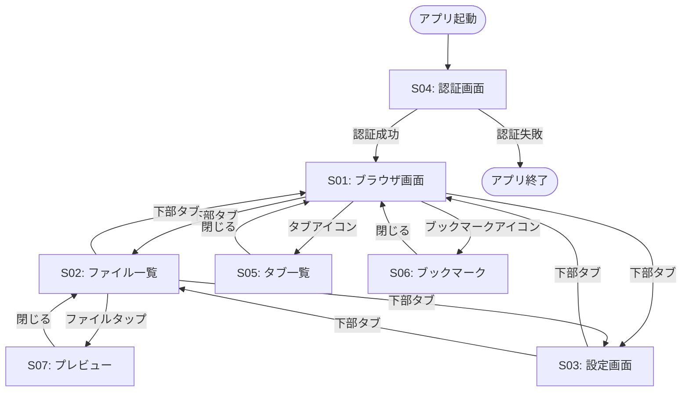

# UI/UX設計

**最終更新**: 2025年10月8日

---

## 📱 画面一覧

| 画面ID | 画面名 | 優先度 | 説明 |
|--------|--------|--------|------|
| **S01** | ブラウザ画面 | Must | メイン画面、Web閲覧 |
| **S02** | ファイル一覧画面 | Must | ダウンロードファイル管理 |
| **S03** | 設定画面 | Must | アプリ設定 |
| **S04** | 認証画面 | Must | 起動時の生体認証 |
| **S05** | タブ一覧画面 | Should | 開いているタブ管理 |
| **S06** | ブックマーク画面 | Should | ブックマーク管理 |
| **S07** | ファイルプレビュー | Nice to have | ファイル詳細表示 |

---

## 🔄 画面遷移図



---

## 🎨 各画面の詳細設計

### S01: ブラウザ画面

**レイアウト**:
```
+----------------------------------+
| [<] [>]  [URL欄................] [⋮] |  ← ナビゲーションバー
+----------------------------------+
|                                  |
|                                  |
|        WebView表示領域            |
|                                  |
|                                  |
|                                  |
|                                  |
+----------------------------------+
| [🌐ブラウザ] [📥DL] [⚙️設定]     |  ← タブバー
+----------------------------------+
```

#### UI要素

| 要素 | 種類 | 説明 | アクション |
|------|------|------|-----------|
| 戻るボタン | Button | 前のページへ | `webView.goBack()` |
| 進むボタン | Button | 次のページへ | `webView.goForward()` |
| URLバー | TextField | URL入力・検索 | Enter押下でページ遷移 |
| メニューボタン | Button | その他機能 | シート表示（ブックマーク追加等） |
| WebView | WKWebView | Webページ表示 | - |
| タブバー | TabView | 画面切替 | - |

#### ユーザーアクション

**アクション1: URL入力**
```
ユーザー: URLバーをタップ
→ キーボード表示
→ URLまたは検索ワード入力
→ Enterキー
→ ページ読み込み開始
→ WebViewに表示
```

**アクション2: リンク長押し**
```
ユーザー: リンクを長押し
→ コンテキストメニュー表示
  - 新しいタブで開く
  - ダウンロード
  - コピー
→ 選択
```

**アクション3: ダウンロード**
```
ユーザー: ファイルリンクをタップ
→ ダウンロード確認ダイアログ
→ 「ダウンロード」ボタン
→ 進捗表示（画面下部）
→ 完了通知
```

#### SwiftUIコード例

```swift
struct BrowserView: View {
    @StateObject private var viewModel = BrowserViewModel()

    var body: some View {
        VStack(spacing: 0) {
            // ナビゲーションバー
            HStack(spacing: 12) {
                Button(action: viewModel.goBack) {
                    Image(systemName: "chevron.left")
                }
                .disabled(!viewModel.canGoBack)

                Button(action: viewModel.goForward) {
                    Image(systemName: "chevron.right")
                }
                .disabled(!viewModel.canGoForward)

                TextField("URLまたは検索", text: $viewModel.urlString)
                    .textFieldStyle(.roundedBorder)
                    .autocapitalization(.none)
                    .onSubmit {
                        viewModel.loadURL()
                    }

                Button(action: {
                    viewModel.showMenu.toggle()
                }) {
                    Image(systemName: "ellipsis")
                }
            }
            .padding()
            .background(Color(.systemBackground))

            // WebView
            WebView(webView: viewModel.webView)

            // 進捗インジケータ
            if viewModel.isLoading {
                ProgressView(value: viewModel.progress)
                    .padding(.horizontal)
            }
        }
        .sheet(isPresented: $viewModel.showMenu) {
            MenuView(viewModel: viewModel)
        }
    }
}
```

---

### S02: ファイル一覧画面

**レイアウト**:
```
+----------------------------------+
|            ダウンロード            |  ← タイトル
+----------------------------------+
| [検索バー.......................]  |
+----------------------------------+
| 📷 IMG_001.jpg          2.3 MB   |
|    2025-10-08 14:23              |
+----------------------------------+
| 🎥 sample_video.mp4    15.8 MB   |
|    2025-10-07 22:15              |
+----------------------------------+
| 📄 document.pdf         1.2 MB   |
|    2025-10-06 09:45              |
+----------------------------------+
|                                  |
| 合計: 3ファイル (19.3 MB)         |
+----------------------------------+
| [🌐ブラウザ] [📥DL] [⚙️設定]     |
+----------------------------------+
```

#### UI要素

| 要素 | 種類 | 説明 |
|------|------|------|
| 検索バー | TextField | ファイル名検索 |
| ファイルリスト | List | ダウンロードファイル一覧 |
| ファイルアイコン | Image | ファイルタイプアイコン |
| ファイル名 | Text | ファイル名表示 |
| ファイルサイズ | Text | サイズ（MB） |
| ダウンロード日時 | Text | 日時表示 |
| 合計表示 | Text | ファイル数・合計サイズ |

#### ユーザーアクション

**アクション1: ファイルタップ**
```
ユーザー: ファイルをタップ
→ プレビュー画面表示（S07）
```

**アクション2: ファイルスワイプ**
```
ユーザー: 左スワイプ
→ 削除ボタン表示
→ タップで削除確認
→ 「削除」で完全削除
```

**アクション3: 検索**
```
ユーザー: 検索バーに入力
→ リアルタイムフィルタ
→ マッチするファイルのみ表示
```

#### SwiftUIコード例

```swift
struct DownloadListView: View {
    @StateObject private var viewModel = DownloadViewModel()

    var body: some View {
        NavigationView {
            VStack {
                // 検索バー
                TextField("検索", text: $viewModel.searchText)
                    .textFieldStyle(.roundedBorder)
                    .padding()

                // ファイルリスト
                List {
                    ForEach(viewModel.filteredFiles) { file in
                        DownloadItemView(file: file)
                            .onTapGesture {
                                viewModel.selectedFile = file
                            }
                    }
                    .onDelete(perform: viewModel.deleteFiles)
                }

                // 合計表示
                HStack {
                    Text("合計: \(viewModel.totalCount)ファイル")
                    Spacer()
                    Text(viewModel.totalSizeFormatted)
                }
                .padding()
                .background(Color(.systemGray6))
            }
            .navigationTitle("ダウンロード")
        }
        .sheet(item: $viewModel.selectedFile) { file in
            FilePreviewView(file: file)
        }
    }
}

struct DownloadItemView: View {
    let file: DownloadedFile

    var body: some View {
        HStack {
            Image(systemName: file.fileTypeIcon)
                .font(.largeTitle)
                .foregroundColor(.blue)

            VStack(alignment: .leading) {
                Text(file.fileName)
                    .font(.headline)

                Text(file.downloadedAt, style: .date)
                    .font(.caption)
                    .foregroundColor(.secondary)
            }

            Spacer()

            Text(file.formattedFileSize)
                .font(.subheadline)
                .foregroundColor(.secondary)
        }
        .padding(.vertical, 4)
    }
}
```

---

### S03: 設定画面

**レイアウト**:
```
+----------------------------------+
|               設定                |
+----------------------------------+
| セキュリティ                      |
|   生体認証                 [ON ✓] |
|   自動削除日数              90日   |
|   削除前通知                7日前  |
+----------------------------------+
| ブラウザ                          |
|   検索エンジン          DuckDuckGo |
|   広告ブロック             [ON ✓] |
+----------------------------------+
| ストレージ                        |
|   使用容量              245.3 MB  |
|   [すべてのファイルを削除]         |
+----------------------------------+
| その他                            |
|   アプリ情報                   >  |
|   プライバシーポリシー          >  |
+----------------------------------+
| [🌐ブラウザ] [📥DL] [⚙️設定]     |
+----------------------------------+
```

#### SwiftUIコード例

```swift
struct SettingsView: View {
    @StateObject private var viewModel = SettingsViewModel()

    var body: some View {
        NavigationView {
            Form {
                // セキュリティ
                Section(header: Text("セキュリティ")) {
                    Toggle("生体認証", isOn: $viewModel.isAuthEnabled)

                    Stepper("自動削除日数: \(viewModel.autoDeleteDays)日",
                           value: $viewModel.autoDeleteDays,
                           in: 30...365)

                    Stepper("削除前通知: \(viewModel.deleteWarningDays)日前",
                           value: $viewModel.deleteWarningDays,
                           in: 1...30)
                }

                // ブラウザ
                Section(header: Text("ブラウザ")) {
                    Picker("検索エンジン", selection: $viewModel.searchEngine) {
                        Text("DuckDuckGo").tag("DuckDuckGo")
                        Text("Google").tag("Google")
                        Text("Bing").tag("Bing")
                    }

                    Toggle("広告ブロック", isOn: $viewModel.adBlockEnabled)
                }

                // ストレージ
                Section(header: Text("ストレージ")) {
                    HStack {
                        Text("使用容量")
                        Spacer()
                        Text(viewModel.storageUsedFormatted)
                            .foregroundColor(.secondary)
                    }

                    Button("すべてのファイルを削除") {
                        viewModel.showDeleteConfirmation = true
                    }
                    .foregroundColor(.red)
                }

                // その他
                Section(header: Text("その他")) {
                    NavigationLink("アプリ情報") {
                        AboutView()
                    }

                    NavigationLink("プライバシーポリシー") {
                        PrivacyPolicyView()
                    }
                }
            }
            .navigationTitle("設定")
        }
        .alert("すべて削除しますか？", isPresented: $viewModel.showDeleteConfirmation) {
            Button("キャンセル", role: .cancel) {}
            Button("削除", role: .destructive) {
                viewModel.deleteAllFiles()
            }
        }
    }
}
```

---

### S04: 認証画面

**レイアウト**:
```
+----------------------------------+
|                                  |
|          🔒                      |
|                                  |
|      Vanish Browser              |
|                                  |
|   Face IDで認証してください       |
|                                  |
|     [Face IDで認証]              |
|                                  |
+----------------------------------+
```

#### SwiftUIコード例

```swift
struct AuthView: View {
    @StateObject private var viewModel = AuthViewModel()

    var body: some View {
        VStack(spacing: 40) {
            Spacer()

            Image(systemName: "lock.shield")
                .font(.system(size: 80))
                .foregroundColor(.blue)

            Text("Vanish Browser")
                .font(.largeTitle)
                .fontWeight(.bold)

            Text("Face IDで認証してください")
                .font(.body)
                .foregroundColor(.secondary)

            Button(action: viewModel.authenticate) {
                Label("Face IDで認証", systemImage: "faceid")
                    .font(.headline)
                    .padding()
                    .frame(maxWidth: .infinity)
                    .background(Color.blue)
                    .foregroundColor(.white)
                    .cornerRadius(10)
            }
            .padding(.horizontal)

            Spacer()
        }
        .onAppear {
            viewModel.authenticate()
        }
    }
}
```

---

## 🎨 デザインガイドライン

### カラーパレット

| 用途 | ライトモード | ダークモード | 説明 |
|------|-------------|-------------|------|
| **Primary** | #1A237E（ネイビー） | #5C6BC0（明るいネイビー） | メインカラー |
| **Background** | #FFFFFF（白） | #121212（黒） | 背景 |
| **Surface** | #F5F5F5（ライトグレー） | #1E1E1E（ダークグレー） | カード背景 |
| **Success** | #4CAF50（グリーン） | #66BB6A（明るいグリーン） | 成功状態 |
| **Warning** | #FF9800（オレンジ） | #FFA726（明るいオレンジ） | 警告 |
| **Danger** | #FF6B6B（レッド） | #E57373（明るいレッド） | 削除等 |
| **Text** | #212121（ダークグレー） | #FFFFFF（白） | テキスト |
| **SecondaryText** | #757575（グレー） | #BDBDBD（ライトグレー） | 補助テキスト |

**Assets.xcassets設定例**:
```swift
// ColorSet: PrimaryColor
Light: #1A237E
Dark:  #5C6BC0
```

---

### タイポグラフィ

| スタイル | フォント | サイズ | 用途 |
|---------|---------|--------|------|
| **Large Title** | SF Pro Bold | 34pt | 画面タイトル |
| **Title** | SF Pro Semibold | 28pt | セクションタイトル |
| **Headline** | SF Pro Semibold | 17pt | ファイル名等 |
| **Body** | SF Pro Regular | 17pt | 本文 |
| **Callout** | SF Pro Regular | 16pt | 強調本文 |
| **Subheadline** | SF Pro Regular | 15pt | 補助情報 |
| **Footnote** | SF Pro Regular | 13pt | 注釈 |
| **Caption** | SF Pro Regular | 12pt | キャプション |

**Dynamic Type対応**:
```swift
Text("タイトル")
    .font(.headline)  // システムフォント使用
    .dynamicTypeSize(.medium ... .xxxLarge)
```

---

### アイコン

**SF Symbols使用**:

| 機能 | アイコン | SF Symbol名 |
|------|---------|------------|
| 戻る | ← | chevron.left |
| 進む | → | chevron.right |
| 更新 | ↻ | arrow.clockwise |
| メニュー | ⋮ | ellipsis |
| タブ | □ | square.on.square |
| ブックマーク | ☆ | star |
| ダウンロード | ↓ | arrow.down.circle |
| 設定 | ⚙ | gearshape |
| 削除 | 🗑 | trash |
| 共有 | ↗ | square.and.arrow.up |

---

### スペーシング

| サイズ | 値 | 用途 |
|--------|-----|------|
| XS | 4pt | 最小マージン |
| S | 8pt | アイテム間 |
| M | 16pt | セクション間 |
| L | 24pt | 画面マージン |
| XL | 32pt | 大セクション間 |

---

## ♿ アクセシビリティ

### VoiceOver対応

**必須設定**:
```swift
Button(action: reload) {
    Image(systemName: "arrow.clockwise")
}
.accessibilityLabel("ページを再読み込み")
.accessibilityHint("現在のページを更新します")

TextField("URL", text: $urlString)
    .accessibilityLabel("URLバー")
    .accessibilityHint("URLまたは検索ワードを入力してください")
```

### カラーコントラスト

**WCAG 2.1 AA準拠**:
- 通常テキスト: 4.5:1以上
- 大きいテキスト: 3:1以上

**確認ツール**:
- Xcode Accessibility Inspector
- Color Contrast Analyzer

### Dynamic Type

**すべてのテキストで対応**:
```swift
Text("タイトル")
    .font(.headline)  // システムフォント使用
```

---

## 📋 UI/UXチェックリスト

### デザイン
- [x] カラーパレット定義
- [x] タイポグラフィ定義
- [x] アイコン選定
- [x] スペーシング定義
- [ ] ワイヤーフレーム作成（全画面）
- [ ] モックアップ作成（主要画面）

### 実装
- [ ] ブラウザ画面実装
- [ ] ファイル一覧画面実装
- [ ] 設定画面実装
- [ ] 認証画面実装
- [ ] ダークモード対応確認
- [ ] Dynamic Type確認

### アクセシビリティ
- [ ] VoiceOverラベル設定
- [ ] カラーコントラスト確認
- [ ] Dynamic Type対応確認

---

**次のドキュメント**: [技術スタック詳細 (../05-development/tech-stack.md)](../05-development/tech-stack.md)
